# LangChain + MCP Playwright Demo

基于 LangChain 框架和 Model Context Protocol (MCP) 的智能浏览器自动化项目。

## ✨ 功能特性

- 🦜 **LangChain 框架**: 强大的大语言模型应用开发框架，提供完整的工具链
- 🔗 **MCP 协议**: Model Context Protocol，统一的模型-工具交互标准
- 🌐 **Playwright 集成**: 基于 MCP 协议的高性能浏览器自动化工具
- 🤖 **智能代理**: 支持自然语言指令的浏览器操作代理
- 🔧 **模块化设计**: 可扩展的工具和组件架构

## 🚀 快速开始

### 1. 环境准备

```bash
# 克隆项目
git clone git@github.com:fujinxiang/LangChain-MCP-Demo.git
cd LangChainDemo

# 安装 Python 依赖
pip install -r requirements.txt

# 安装 Playwright 浏览器
playwright install

# 安装 MCP Playwright 服务器，这是此 Demo 使用的 MCP 服务
npm install -g @executeautomation/playwright-mcp-server
```

### 2. 配置 API Key（此 Demo 以 硅基流动 API Key 为例，其他大模型 API 同理）

访问 [硅基流动官网 https://cloud.siliconflow.cn/i/bWxkTKYc](https://cloud.siliconflow.cn/i/bWxkTKYc) 注册账号

访问 [模型选择 https://cloud.siliconflow.cn/models](https://cloud.siliconflow.cn/models) 选择自己想要的模型，比如 `Qwen/Qwen3-32B`，复制模型 ID

访问 [API 密钥 https://cloud.siliconflow.cn/account/ak](https://cloud.siliconflow.cn/account/ak) 创建并复制 API 密钥

复制 .env.example 为 `.env` 文件并配置 硅基流动 API 密钥和模型

```env
# LLM API 配置 (示例使用硅基流动)
# 硅基流动 API 配置
SILICONFLOW_API_KEY=your_api_key_here
SILICONFLOW_BASE_URL=https://api.siliconflow.cn/v1

# 模型配置
DEFAULT_MODEL=Qwen/Qwen3-32B
TEMPERATURE=0.7
MAX_TOKENS=1000
```

### 3. 运行演示

```bash
# 运行 MCP Playwright 演示
python mcp_demo.py

# 输入自然语言指令，例如 "百度搜索 LangChain"，观察浏览器自动化操作
```

## 📁 项目结构

```
LangChainDemo/
├── utils/
│   ├── llm_wrapper.py          # LLM 包装器
│   └── mcp_browser_tools.py    # MCP Playwright 工具
├── mcp_demo.py                 # MCP Playwright 演示
├── setup_mcp.py               # 自动化安装脚本
├── config.py                  # 配置文件
├── requirements.txt           # Python 依赖
└── README.md                  # 项目说明
```

## 🔧 核心代码说明


### 代码架构图

```mermaid
graph TD
    mcp_demo[mcp_demo.py 主演示程序] --> llm_wrapper[utils/llm_wrapper.py LLM 包装器]
    mcp_demo --> mcp_browser_tools[utils/mcp_browser_tools.py MCP Playwright 工具]
    mcp_demo --> config[config.py 配置管理]
    
    llm_wrapper --> langchain_llm[LangChain LLM 语言模型实例]
    mcp_browser_tools --> mcp_server[playwright-mcp-server]
    
    config --> env_file[环境变量 .env 文件]
    
    mcp_server --> playwright_browser[Playwright 浏览器自动化操作]
```



### LangChain LLM 包装器

`utils/llm_wrapper.py` 提供了 LLM API 的 LangChain 集成：

```python
from utils.llm_wrapper import create_llm

# 创建 LLM 实例
llm = create_llm()
# 调用 LLM
response = await llm.ainvoke("你好，请介绍一下硅基流动")
print(response)
```

### MCP 工具

`utils/mcp_browser_tools.py` 使用 `langchain-mcp-adapters` 集成 MCP Playwright 服务器，提供了浏览器自动化功能：

#### 核心组件

1. **MultiServerMCPClient**: 管理 MCP 服务器连接
2. **load_mcp_tools**: 将 MCP 工具转换为 LangChain 工具
3. **MCPPlaywrightAgent**: 封装的浏览器代理类

#### MCP Server 配置，类似 Cursor 配置

```python
# 自定义 MCP 服务器配置
config = {
    "playwright": {
        "command": "npx",
        "args": ["@executeautomation/playwright-mcp-server"],
        "transport": "stdio"
    }
}

agent = MCPPlaywrightAgent(mcp_server_config=config)
```

#### 获取 MCP tools 供 LLM 使用

```python
from langchain_mcp_adapters.client import MultiServerMCPClient

    self.client = MultiServerMCPClient(self.mcp_server_config)
    
    # 使用正确的异步上下文管理器方式创建会话
    self._session_context = self.client.session("playwright")
    self.session = await self._session_context.__aenter__()
    
    # 加载工具
    from langchain_mcp_adapters.tools import load_mcp_tools
    self.tools = await load_mcp_tools(self.session)
    
    print(f"✅ MCP Playwright 工具包初始化成功，可用工具: {len(self.tools)} 个")
```


### MCP Demo 

```python
import asyncio
from utils.llm_wrapper import create_llm
from utils.mcp_browser_tools import create_mcp_browser_agent

async def demo():
    # 创建 LLM 实例
    llm = create_llm()
    
    # 创建智能浏览器代理
    agent = create_mcp_browser_agent(llm)
    
    # 使用自然语言指令
    result = await agent.execute_smart_task("打开百度，搜索'人工智能'")
    print(result)
    
    # 关闭代理
    await agent.close()

asyncio.run(demo())
```


## 🧠 LangChain 集成

LangChain 框架提供了强大的 LLM 应用开发能力：

- **Agent 架构**: 智能决策和工具选择
- **Memory 管理**: 对话历史和上下文保持
- **Chain 组合**: 复杂任务的分解和执行
- **Tool 集成**: 丰富的工具生态系统

## 🛠️ MCP 协议说明

Model Context Protocol (MCP) 是一个统一的协议标准，用于大语言模型与外部工具的交互。本项目通过 MCP 协议实现了：

- **标准化工具接口**: 统一的工具调用和响应格式
- **类型安全**: 完整的工具参数类型定义和验证
- **异步支持**: 高性能的异步工具执行
- **扩展性**: 易于添加新的工具和功能

## 🔗 相关链接

- [LangChain](https://langchain.com/)
- [MCP 协议](https://modelcontextprotocol.io/)
- [Playwright](https://playwright.dev/)
- [硅基流动 API](https://siliconflow.cn/)